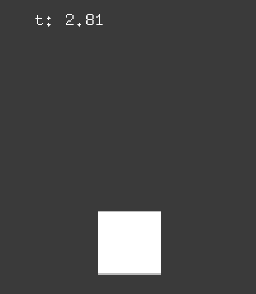
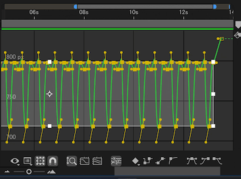

# go_ae_easing_loader




AE Easing Loader for Go (Pure Go)

Go port from [ofxAEEasingLoader](https://github.com/funatsufumiya/ofxAEEasingLoader)

> [!WARNING]
> Go port was almost done by GitHub Copilot. Use with care.

## Example

```bash
$ git clone https://github.com/funatsufumiya/go_ae_easing_loader
$ cd go_ae_easing_loader
$ go run ./examples/simple/main.go
```

## Editor

see [ofxAEEasingLoader/README.md#appendix-json-editor](https://github.com/funatsufumiya/ofxAEEasingLoader?tab=readme-ov-file#appendix-json-editor)

## License

0BSD or WTFPL